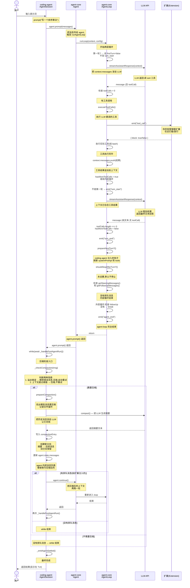

# pi源码学习
## agent Loop详解
一个请求从发出到返回

```mermaid
sequenceDiagram
    actor 用户
    participant agent_session as coding-agent<br/>AgentSession
    participant agent_core as agent-core<br/>Agent
    participant agent_loop as agent-core<br/>AgentLoop
    participant LLM as LLM API
    participant extension as 扩展(Extension)

    用户->>agent_session: 输入提示词
    Note over agent_session: prompt("写一个排序算法")

    agent_session->>agent_core: agent.prompt(messages)
    Note over agent_core: 把消息传给 agent,<br/>触发 runAgentLoop

    agent_core->>agent_loop: runLoop(context, config)
    Note over agent_loop: 开始两层循环

    %% 内层循环第一次
    agent_loop->>agent_loop: 第一轮? → 设 firstTurn=false<br/>不发 turn_start

    agent_loop->>LLM: streamAssistantResponse(context)
    Note over agent_loop: 把 context.messages 发给 LLM
    Note over LLM: LLM 返回:调 sort 工具
    LLM-->>agent_loop: message (含 toolCall)

    agent_loop->>agent_loop: 检查 toolCalls > 0
    Note over agent_loop: 有工具调用

    agent_loop->>agent_loop: executeToolCalls()
    Note over agent_loop: 执行 LLM 要调的工具

    agent_loop->>extension: emit("tool_call")
    Note over extension: 你的权限弹窗扩展<br/>在这拦截/放行

    extension-->>agent_loop: { block: true/false }

    agent_loop->>agent_loop: 执行实际工具(如 bash)
    Note over agent_loop: 工具执行完毕

    agent_loop->>agent_loop: context.messages.push(结果)
    Note over agent_loop: 工具结果追加到上下文

    agent_loop->>agent_loop: hasMoreToolCalls = true<br/>继续内层循环

    %% 内层循环第二次
    agent_loop->>agent_loop: 不是第一轮 → emit("turn_start")

    agent_loop->>LLM: streamAssistantResponse(context)
    Note over agent_loop: 上下文已包含工具结果
    Note over LLM: LLM 看到结果<br/>返回最终文本回答
    LLM-->>agent_loop: message (纯文本,无 toolCall)

    agent_loop->>agent_loop: toolCalls.length === 0<br/>hasMoreToolCalls = false

    agent_loop->>agent_loop: emit("turn_end")

    agent_loop->>agent_loop: prepareNextTurn?()
    Note over agent_loop: coding-agent 注入的钩子<br/>刷新 systemPrompt 和 tools

    agent_loop->>agent_loop: shouldStopAfterTurn?()
    Note over agent_loop: 未设置,默认不停止

    agent_loop->>agent_loop: 检查 getSteeringMessages()<br/>和 getFollowUpMessages()
    Note over agent_loop: 没有排队消息<br/>内层循环结束

    agent_loop->>agent_loop: 外层循环:检查 followUp<br/>没有 → break

    agent_loop->>agent_loop: emit("agent_end")
    Note over agent_loop: agent-loop 完全结束

    agent_loop-->>agent_core: return
    Note over agent_core: agent.prompt() 返回

    agent_core-->>agent_session: agent.prompt() 返回

    %% 下面是 coding-agent 的后续处理
    agent_session->>agent_session: while(await _handlePostAgentRun())
    Note over agent_session: 压缩检查入口

    agent_session->>agent_session: _checkCompaction(msg)
    Note over agent_session: 判断两种场景:<br/>1. 溢出错误 → 删除错误消息,压缩,自动重试<br/>2. 上下文超过阈值 → 压缩,不重试

    alt 需要压缩
        agent_session->>agent_session: prepareCompaction()
        Note over agent_session: 找出哪些消息要压缩<br/>记录文件操作

        agent_session->>LLM: compact() — 调 LLM 生成摘要
        Note over agent_session: 把历史消息发给 LLM<br/>让它总结

        LLM-->>agent_session: 返回摘要文本

        agent_session->>agent_session: 写入 compactionEntry
        Note over agent_session: 创建新分支:<br/>摘要 → 后续消息<br/>旧分支保留

        agent_session->>agent_session: 更新 agent.state.messages
        Note over agent_session: agent 内部消息列表<br/>被替换为压缩后的

        alt 有排队消息(如扩展注入的)
            agent_session->>agent_core: agent.continue()
            Note over agent_core: 用压缩后的上下文<br/>再跑一轮
            agent_core->>agent_loop: 重新进入 loop
            agent_loop-->>agent_core: 结束
            agent_core-->>agent_session: 返回
            agent_session->>agent_session: 再次 _handlePostAgentRun()
        else 没有排队消息
            Note over agent_session: while 结束
        end
    else 不需要压缩
        Note over agent_session: 没有排队消息 → while 结束
    end

    agent_session->>agent_session: _emitAgentSettled()
    Note over agent_session: 最终完成

    agent_session-->>用户: 返回结果(显示在 TUI)

```
